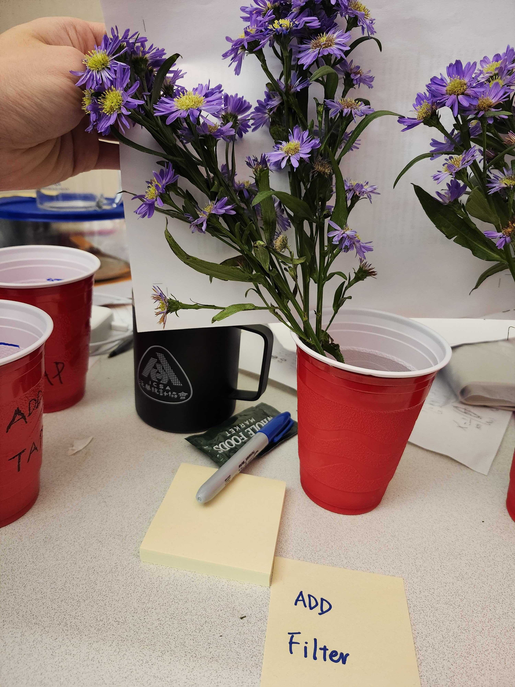

# Lab Notebook — Project 3: How to Keep Flowers Fresh
  
  **Team**: Seyong Hwang, Elvin Tseng, Xiaoyu Qiu, Hanbin Lee  

<!-- ## Experiment Overview
- Design: 2×2 factorial design  
A: Preservative (Yes/No)  
B: Water type (Tap/Filtered)  
4 vases (one per treatment cell).  
- Observation every 3 days in the first week, and everyday in the second week 
---
-->
## Experiment Setup and Protocol

### Objective
 To test how (A) adding preservative and (B) water type (tap vs. filtered) affect the freshness of cut flowers kept in the office.

### Materials and Flower Source
 - Flower species: Purple daisy (purchased from Whole Foods; $6 per bouquet; 2 bouquets).
 - Purchase date: Oct 14, 2025.
 - Vase type: Identical clear plastic cups (~300 mL).
 - Each vase represents one treatment cell in the 2×2 design.

### Treatments (2×2 Factorial Design)
  | Factor A | Factor B | Label | Vase ID |
  |-----------|-----------|--------|---------|
  | Preservative = Yes | Water = Filtered | A1 | V01 |
  | Preservative = No  | Water = Filtered | B1 | V02 |
  | Preservative = Yes | Water = Tap | A2 | V03 |
  | Preservative = No  | Water = Tap | B2 | V04 |

<!-- ## General Environment and Water Preparation -->

### Environment
 - **Location**: Office WH436 (indoor, stable temperature) 
 - **Average temperature**: ~20°C.  
 - **Lighting**: Consistent indirect office light; no direct sunlight.  
 - **Air circulation**: Standard office ventilation; no additional airflow.  
 - **Water change frequency**: About every 3 days.
 - **Vase placement**: All four vases were placed side by side on the same desk, ensuring that
  light exposure, temperature, and air flow were identical across treatments.
  This placement **effectively controlled for environmental confounders**.

### Water Preparation and Handling
 - **Tap water:** Collected from office sink. 
 - **Filtered water:** Obtained from office dispenser; room temperature.  
 - **Preservative solution:** Commercial packet (1 packet/500 mL water), prepared fresh on each observation day.  
 - **Volume per vase:** 300 mL of the assigned water type.  
- **Water change protocol:** Water was replaced approximately every 3 days.  
  All four vases were refilled **at the same time** during each observation to control for timing-related confounders.  
  Each vase was rinsed lightly before refill.  
 - **Handling:** Flowers trimmed to uniform stem length (~25 cm); leaves below waterline removed.  

### Outcome Measurement
 We initially planned to analyze photos of the flowers to assign freshness scores.  
 However, after the first observation, we realized that scoring was difficult and the flowers were declining faster than expected.  
 Therefore, we decided to **count the number of dead and dying blossoms per vase** at each observation.  
 
 - Definitions:
   - `N_total`: Total number of blossoms per vase at baseline (Day 0).
   - `N_dying`: Blossoms visibly wilting/browning but not fully necrotic or detached.
   - `N_dead`: Blossoms fully necrotic or detached.

---
## Observation Records

 ### Day 0 — Setup (Oct 16, 2025) 
 - Randomized 16 stems into 4 groups of 4 stems each. 
 - Counted initial blossoms per vase (N_total):  
   | Vase | Preservative | Water | N_total 
   |------|---------------|--------|--------------|
   | V01 | Yes | Filtered |  46 |
   | V02|  No | Filtered | 47 |
   | V03| Yes | Tap |   35 |
   | V04| No | Tap | 36 |

---
 ### Oct 19, 2025
 - Changed the water for all vases; treatments unchanged.
 - Took photos.

  
 - After this observation, we noticed the flowers were declining faster than expected, so we chose blossom counts by status as the primary measurement.

 ### Oct 21, 2025
 - Observed the flowers and decided to count the number of dead/dying blossoms per vase.
    | Vase | Preservative | Water | N_total | N_dying | N_dead | 
    |------|---------------|--------|--------------| ------------| ------------|
    | V01 | Yes | Filtered |  46 | 1 | 4|
    | V02|  No | Filtered | 47 |  11| 5 |
    | V03| Yes | Tap |  35 | 4 | 0|
    | V04| No | Tap | 36 |  16 | 1 |

---

 ### Oct 23, 2025
 - Changed the water and counted the number of dead/dying blossoms per vase.
  
    | Vase | Preservative | Water | N_total | N_dying | N_dead | 
    |------|---------------|--------|--------------| ------------| ------------|
    | V01 | Yes | Filtered |  46 | 3 | 5 |
    | V02|  No | Filtered | 47 | 16 | 8 |
    | V03| Yes | Tap |   35 | 3 | 1 |
    | V04| No | Tap | 36 |15  | 4  |

---

 ### Oct 24, 2025
 - Counted the number of dead/dying blossoms per vase.
    | Vase | Preservative | Water | N_total | N_dying | N_dead | 
    |------|---------------|--------|--------------| ------------| ------------|
    | V01 | Yes | Filtered |  46 | 3 | 5 |
    | V02|  No | Filtered | 47 | 13 | 23 |
    | V03| Yes | Tap |   35 | 3 | 1 |
    | V04| No | Tap | 36 | 11 | 12 |

---

 ### Oct 25, 2025
 - Counted the number of dead/dying blossoms per vase.
    | Vase | Preservative | Water | N_total | N_dying | N_dead | 
    |------|---------------|--------|--------------| ------------| ------------|
    | V01 | Yes | Filtered |  46 | 5 | 5 |
    | V02|  No | Filtered | 47 | 17 | 28 |
    | V03| Yes | Tap |   35 | 5 | 3 |
    | V04| No | Tap | 36 | 17 | 13 |

---
