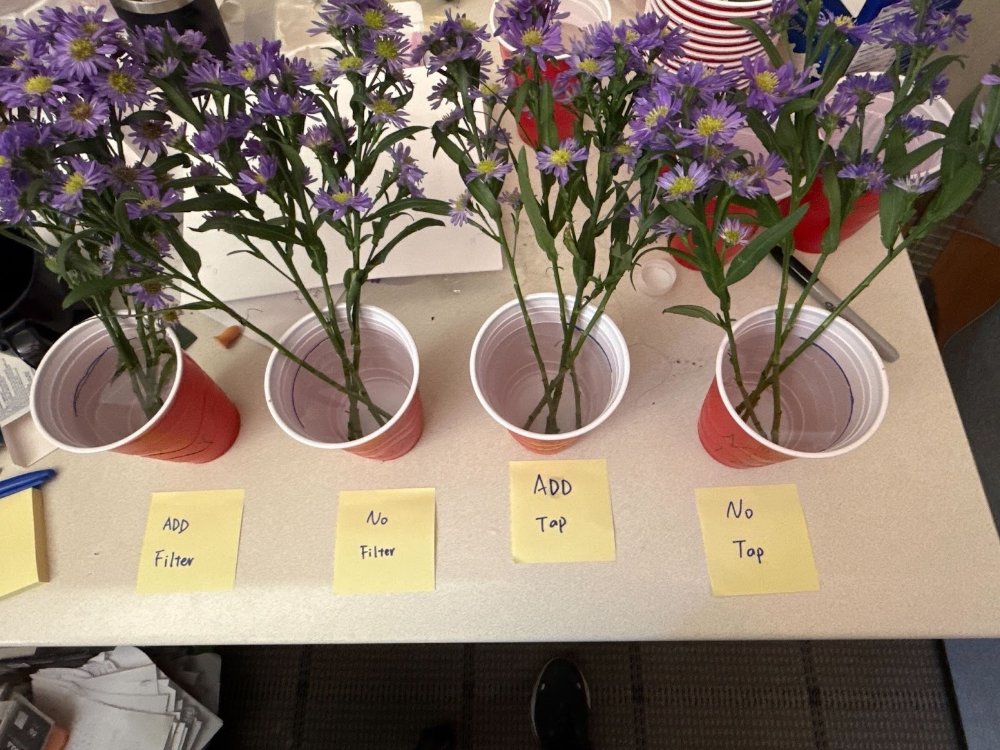

---
output:
  pdf_document: default
  html_document: default
---
# Project 3 Pre-analysis Plan 
## Seyong Hwang, Elvin Tseng, Xiaoyu Qiu, Hanbin Lee

## 1. Objective

Estimate the effects of:

- (A) adding preservative or not 
-  (B) water type (tap vs filtered)

 on the longevity of cut flowers kept in the office. We also record stem length (short/long) as a blocking factor and exploratory modifier. We will maintain a lab notebook and make all analyses reproducible per course guidelines.

## 2. Design, units, treatments, blocking, randomization

- Treatments (2×2):
  - A: Preservative = {Yes, No}
  - B: Water type = {Tap, Filtered}
- Containers: one identical bottle per 4 stems 
- Blocking factors:  Stem length (short/long).
- Randomization: Within each block (Length), assign stems uniformly at random to the 4 cells (equal allocation). Record a seeded assignment table for reproducibility.
- Water changes: every 3 days for all vases; observations taken at change times and on Day 0.

## 3. Outcomes  measurement schedule

-  Outcome measurement:
    - Number of dead and dying blossoms in each vase at each observation to measure the freshness.
    - From the daily blossom counts, we can further have the vase-level failure rate.

## 4. Analysis plan

- 4-1. Permutation Test
-Permutation test on A by blocking B, stem length(short, long)
-Permutation test on B by blocking A, stem length(short, long)
-multiple testing if necessary

-  4-2. Regression Analysis
Response variable: Number of dying and dead blossoms
Explanatory variables: Number of blossoms, time, (A), (B), stem length

- 4-3. Survival Analysis
-Permutation test on A by blocking B, stem length(short, long)
-Permutation test on B by blocking A, stem length(short, long)
We fit cox regression to the proportion of live blossoms for each treatment permutation.
The P-value is computed from the quantile of the realized treatment assignment in the permutation distribution. 
